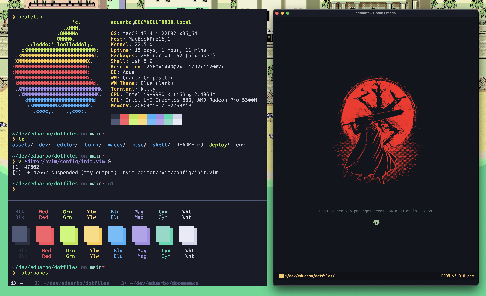
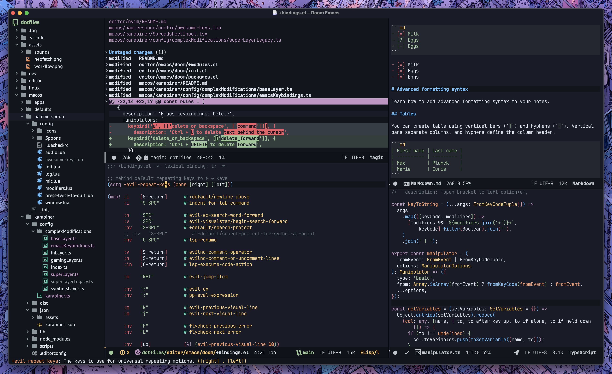

# My homies ese! 😎

A tidy `$HOME` is a tidy mind.






These are my dotfiles, designed primarily for macOS (Apple silicon) and Debian 12, heavily inspired by
[hlissner/dotfiles](https://github.com/hlissner/dotfiles). They are my specific
breed of madness, split into 2-level topics (e.g. `shell/zsh`) that strive for
minimum `$HOME` presence (adhering to XDG standards where possible).


## Quick start

```sh
git clone https://github.com/eduarbo/dotfiles.git ~/.config/dotfiles
```

## Dependencies
- [Homebrew](https://brew.sh/) (for macOS)
- git
- zsh
- curl

## What does it include?

The following are the categories and topics you can install:

- `macos/` – Mac-specific tools and tweaks
  - `apps` – The essential macOS app lineup I can't live without
  - `defaults` – Opinionated values for a saner (and possibly sassier) macOS
  - `hammerspoon` – Lua-powered automation for pro-level productivity
    - Window wrangling made easy
    - Lightning-fast app launcher
    - Push-to-talk microphone magic
    - Instantly swap your audio outputs like a DJ
  - `karabiner` – The ultimate keyboard wizardry (remap all the things!)

- `editor/` – My battle-stations for text and code
  - `emacs` – The best of both Emacs and Vim worlds, with extra chaos
  - `nvim` – My nimble sidekick for those “just one quick edit” moments
  - `coding-style` – Keep your code prettier than your neighbor's garden

- `shell/` – Terminal superpowers and creature comforts
  - `git` – Snazzy aliases and Zsh plugins for effortless versioning
  - `tmux` – Tab-multiplying terminal wizardry
  - `zsh` – The shell with speed, features, and a prompt that actually sparks joy
  - `kitty` – The terminal so full-featured, even your cat would approve

- `dev/` – Essential tools and setups for a life in code
  - `lua` – Harness the power of luaenv and keep your Lua scripts flowing
  - `node` – Install nodenv: because who wants to remember which version of Node broke what?
  - `python` – Pyenv to rule them all, so every script gets the right snake
  - `golang` – Go fast, install Go, and grab some must-have packages
  - `php` – Composer support included, because sometimes you just can’t avoid PHP


## Dotfile management

```
Usage: deploy [-acdlLit] [TOPIC...]

  -a   Target all enabled topics (ignores TOPIC args)
  -c   Afterwards, remove dead symlinks & empty dot-directories in $HOME.
       Can be used alone.
  -d   Unlink and run `./_init clean` for topic(s)
  -l   Only relink topic(s) (implies -i)
  -L   List enabled topics
  -i   Inhibit install/update/clean init scripts
  -t   Do a test run; do not actually do anything
```

e.g.
+ `deploy misc/kitty shell/{zsh,tmux}`: enables misc/kitty, shell/zsh & shell/tmux
+ `deploy -d shell/zsh`: disables shell/zsh & cleans up after it
+ `deploy -l shell/zsh`: refresh links for shell/zsh (inhibits init script)
+ `deploy -l`: relink all enabled topics
+ `deploy -L`: list all enabled topics

Here's a breakdown of what the script does:

``` sh
cd $topic
if [[ -L $DOTFILES_DATA/${topic/\//.}.topic ]]; then
    ./_init update
else
    ln -sfv $DOTFILES/$topic $DOTFILES_DATA/${topic/\//.}.topic

    ./_init install
    ./_init link
fi
```

## Best practices

- Generate one key per client device with `ssh-keygen -t ed25519 -C "your_email@example.com"` and protect it with a strong passphrase

## Troubleshooting

### Signing Git commit with GPG ask passphrase everytime

Make sure the GPG key ID is correct. You can get a list of GPG keys with
`gpg --list-secret-keys --keyid-format LONG` and then set it in Git with
`git config --global user.signingkey [GPG-key-ID]`.

More details in [Telling Git about your GPG key](https://help.github.com/articles/telling-git-about-your-gpg-key/).

### git@github.com: Permission denied (publickey)

Just [add your SSH Key](https://docs.github.com/en/authentication/connecting-to-github-with-ssh/adding-a-new-ssh-key-to-your-github-account) to your GitHub account


## Relevant projects/resources

+ [DOOM Emacs](https://github.com/doomemacs/doomemacs) (pulled by `editor/emacs`)
+ [Pacmux Tmux theme](https://github.com/eduarbo/pacmux) (pulled by `shell/tmux`)
+ [Simpl ZSH prompt](https://github.com/eduarbo/simpl) (pulled by `shell/zsh`)
