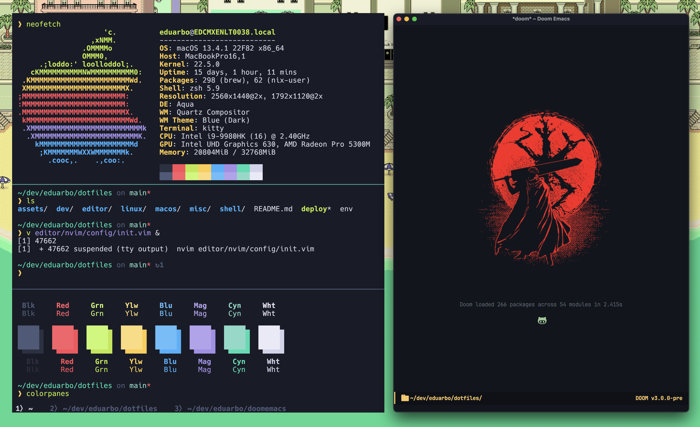
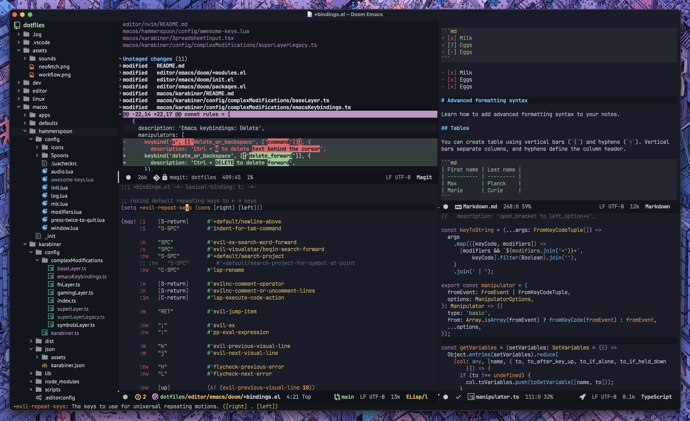

# My homies ese! 😎

A tidy `$HOME` is a tidy mind.






These are my dotfiles, designed primarily for macOS (Apple silicon) and Debian 12, heavily inspired by
[hlissner/dotfiles](https://github.com/hlissner/dotfiles). Topics are split into `category/topic` (e.g. `shell/zsh`), aim for XDG compliance, and clutter your `$HOME` as little as possible.


## Dependencies
- [Homebrew](https://brew.sh/) (for macOS)
- git
- zsh
- curl


## Quick start

```sh
git clone --recurse-submodules https://github.com/eduarbo/dotfiles.git ~/.config/dotfiles
```


## What does it include?

The following are the categories and topics you can install:

- `macos/` – Mac-specific tools and tweaks
  - `apps` – The essential macOS app lineup I can't live without
  - `defaults` – Opinionated values for a saner (and possibly sassier) macOS
  - `hammerspoon` – Lua-powered automation for pro-level productivity
    - Window wrangling without the wrestling
    - Lightning-fast app launcher
    - Push-to-talk mic sorcery
    - Instantly swap your audio outputs like a DJ
  - `karabiner` – The ultimate keyboard wizardry to remap all the things

- `editor/` – My battle-stations for text and code
  - `emacs` – The best of both Emacs and Vim worlds, with extra chaos
  - `nvim` – My nimble sidekick for those “just one quick edit” moments
  - `coding-style` – Keep your code prettier than your neighbor's garden

- `shell/` – Terminal superpowers and creature comforts
  - `git` – Snazzy aliases and Zsh plugins for effortless versioning
  - `tmux` – Tab-multiplying terminal wizardry
  - `zsh` – The shell with speed, features, and a prompt that actually sparks joy
  - `kitty` – The terminal so full-featured, even your cat would approve
  - `claude-code` – Custom status line for Claude Code CLI, integrated with Powerlevel10k

- `dev/` – Essential tools and setups for a life in code
  - `mise` – Universal version manager for Node, Python, Lua and more
  - `lua` – Lua runtime via mise, luarocks packages, and luacheck linter
  - `node` – npm/pnpm package management — runtime versions handled by mise
  - `python` – Python tooling via brew and pipx — runtime versions handled by mise
  - `golang` – Go fast, install Go, and grab some must-have packages
  - `php` – Composer support included, because sometimes you just can’t avoid PHP


## Dotfile management

```
Usage: deploy [-acdlLit] [TOPIC...]

  -a   Target all enabled topics (ignores TOPIC args)
  -c   Afterwards, remove dead symlinks & empty dot-directories in $HOME.
       Can be used alone.
  -d   Unlink and run `./_init clean` for topic(s)
  -l   Only relink topic(s) (implies -i)
  -L   List enabled topics
  -i   Inhibit install/update/clean init scripts
  -t   Do a test run; do not actually do anything
```

### Examples
+ `deploy shell/zsh macos/kitty`: enables `shell/zsh` and `macos/kitty`
+ `deploy -d shell/zsh`: disables shell/zsh & cleans up after it
+ `deploy -l shell/zsh`: refresh links for shell/zsh (inhibits init script)
+ `deploy -l`: relink all enabled topics
+ `deploy -L`: list all enabled topics

Here's a breakdown of what the script does:

``` sh
cd $topic
if [[ -L $DOTFILES_DATA/${topic/\//.}.topic ]]; then
    ./_init update
else
    ln -sfv $DOTFILES/$topic $DOTFILES_DATA/${topic/\//.}.topic

    ./_init install
    ./_init link
fi
```

## Best practices

- If you use a password manager like 1Password, managing SSH keys is a breeze (and much more convenient). But if you're old-school (or just like a little DIY), you can still generate SSH keys manually:

  ```sh
  ssh-keygen -t ed25519 -C "personal-mbpro-2025" # Use a descriptive comment: purpose + device + year
  ```

### Managing Forge/GitHub Tokens

Forge (Magit’s helper for GitHub/GitLab) expects your personal access token to be stored in `~/.authinfo.gpg`, or another location specified in your auth-sources. This file should never be committed to your repository.

To set up your tokens securely:
- This repo provides an `authinfo.gpg.example` template. Copy or rename this file to `authinfo.gpg` in the same location
- Run `dot -l doom/emacs` to link the file
- Open and edit the file in Emacs to add your tokens, then save. Emacs will manage the GPG encryption for you

By following these steps, your dotfiles remain clean, secure, and portable—reducing the risk of accidentally exposing your credentials.

## Troubleshooting

### Signing Git commit with GPG ask passphrase everytime

Make sure the GPG key ID is correct. You can get a list of GPG keys with
`gpg --list-secret-keys --keyid-format LONG` and then set it in Git with
`git config --global user.signingkey [GPG-key-ID]`.

More details in [Telling Git about your GPG key](https://help.github.com/articles/telling-git-about-your-gpg-key/).

### git@github.com: Permission denied (publickey)

Just [add your SSH Key](https://docs.github.com/en/authentication/connecting-to-github-with-ssh/adding-a-new-ssh-key-to-your-github-account) to your GitHub account


## Relevant projects/resources

+ [DOOM Emacs](https://github.com/doomemacs/doomemacs) (pulled by `editor/emacs`)
+ [Pacmux Tmux theme](https://github.com/eduarbo/pacmux) (pulled by `shell/tmux`)
+ [Simpl ZSH prompt](https://github.com/eduarbo/simpl) (pulled by `shell/zsh`)
