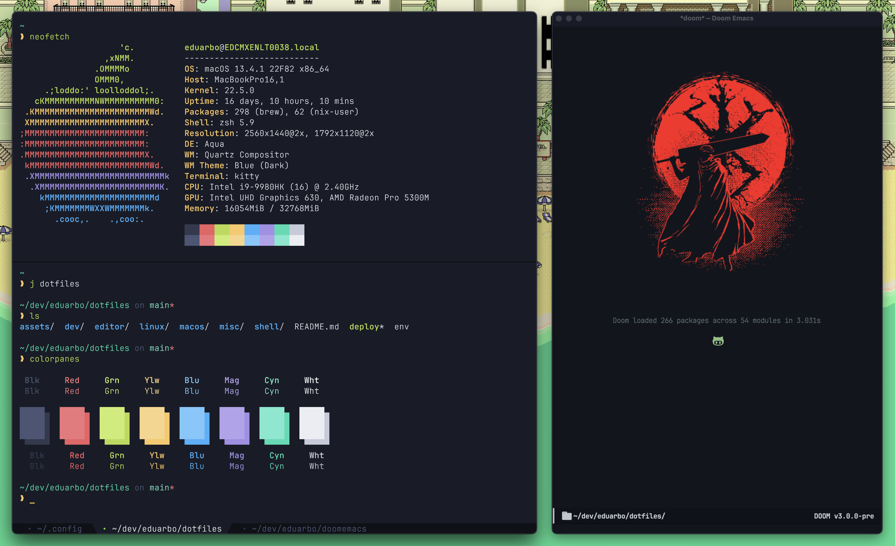

# My homies ese! 😎

A tidy `$HOME` is a tidy mind.





These are my dotfiles, designed primarily for macOS and *Debian (well... it has
only been tested on Ubuntu Server 20.04 ¯\\\_(ツ)\_/¯), heavily inspired by
[hlissner/dotfiles](https://github.com/hlissner/dotfiles). They are my specific
breed of madness, split into 2-level topics (e.g. `shell/zsh`) that strive for
minimum `$HOME` presence (adhering to XDG standards where possible).


## Quick start

```sh
git clone https://github.com/eduarbo/dotfiles.git ~/.config/dotfiles
```

## Dependencies
- [Homebrew](https://brew.sh/)
- git
- zsh

## What does it include?

The following are the categories and topics available to install:

- `linux/` - Linux compatible utilities
  - `defaults` - bare essentials for Linux

- `macos/` - macOS compatible utilities
  - `apps` - collection of macOS apps that I use on a daily basis
  - `defaults` - bare essentials for macOS
  - `hammerspoon` - a bunch of lua scripts to boost my productivity
  - `kitty` - well, in fact there is a better macOS terminal
  - `karabiner` - powerful keyboard customizer

- `misc/` - Very handy apps & tools
  - `surfingkeys` - vim-like bindings for Google Chrome & Firefox

- `editor/` - Configuration for my text editors
  - `emacs` - the best of Emacs and Vim in one place
  - `vim` - for quick file editing

- `shell/` - Shell utilities
  - `bash` - not my default shell but doesn't hurt to have a basic config
  - `git` - nice aliases and zsh plugins
  - `tmux` - window manager within the terminal + nice plugins
  - `zsh` - my shell of choice, fast, powerful and with a nice prompt

- `dev/` - Relevant to software development & programming in general
  - `lua` - manage lua environments with luaenv
  - `node` - setup nodenv, a lightweight alternative to nvm
  - `python` - setup pyenv, a simple Python version management


## Dotfile management

```
Usage: deploy [-acdlLit] [TOPIC...]

  -a   Target all enabled topics (ignores TOPIC args)
  -c   Afterwards, remove dead symlinks & empty dot-directories in $HOME.
       Can be used alone.
  -d   Unlink and run `./_init clean` for topic(s)
  -l   Only relink topic(s) (implies -i)
  -L   List enabled topics
  -i   Inhibit install/update/clean init scripts
  -t   Do a test run; do not actually do anything
```

e.g.
+ `deploy misc/kitty shell/{zsh,tmux}`: enables misc/kitty, shell/zsh & shell/tmux
+ `deploy -d shell/zsh`: disables shell/zsh & cleans up after it
+ `deploy -l shell/zsh`: refresh links for shell/zsh (inhibits init script)
+ `deploy -l`: relink all enabled topics
+ `deploy -L`: list all enabled topics

Here's a breakdown of what the script does:

``` sh
cd $topic
if [[ -L $DOTFILES_DATA/${topic/\//.}.topic ]]; then
    ./_init update
else
    ln -sfv $DOTFILES/$topic $DOTFILES_DATA/${topic/\//.}.topic

    ./_init install
    ./_init link
fi
```

## Best practices

- Generate one key per client device with `ssh-keygen -t ed25519 -C "your_email@example.com"` and protect it with a strong passphrase

## Troubleshooting

### Signing Git commit with GPG ask passphrase everytime

Make sure the GPG key ID is correct. You can get a list of GPG keys with
`gpg --list-secret-keys --keyid-format LONG` and then set it in Git with
`git config --global user.signingkey [GPG-key-ID]`.

More details in [Telling Git about your GPG key](https://help.github.com/articles/telling-git-about-your-gpg-key/).

### git@github.com: Permission denied (publickey)

Just [add your SSH Key](https://docs.github.com/en/authentication/connecting-to-github-with-ssh/adding-a-new-ssh-key-to-your-github-account) to your GitHub account


## Relevant projects/resources

+ [DOOM Emacs](https://github.com/doomemacs/doomemacs) (pulled by `editor/emacs`)
+ [Pacmux Tmux theme](https://github.com/eduarbo/pacmux) (pulled by `shell/tmux`)
+ [Simpl ZSH prompt](https://github.com/eduarbo/simpl) (pulled by `shell/zsh`)
