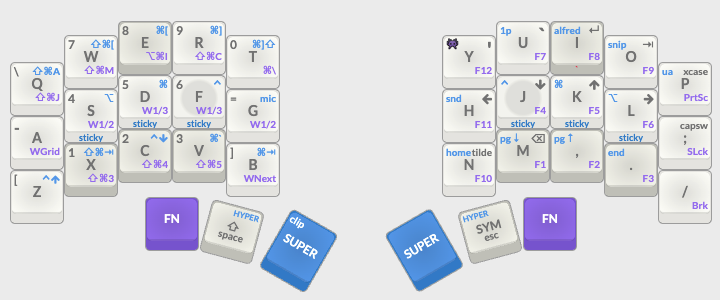

# KEGen

This is my Karabiner-Elements Configuration Generator in an attempt to manage my configuration easily.

## Development: Build JSON files

Use the following command to generate the JSON files for `karabiner.json` and complex modifications:

``` shell
npm run build
```

## My layout

This layout is designed to match the QMK layout of my main keyboard, a 36-key Piantor Pro. The two central keys in the thumb cluster represent the spacebar on the MacBook keyboard. My goal is to seamlessly switch between the two keyboards, as I don't always carry my mechanical keyboard with me 😞

### Symbols chart

#### Modifiers

| Symbol | description   | Symbol | description    |
|--------|---------------|--------|----------------|
| `⌘`    | command       | `⌥`    | option         |
| `⌃`    | control       | `⇧`    | shift          |
| `𝕊`    | super (`⌘⌥⌃`) | `ℍ`    | hyper (`⇧⌘⌥⌃`) |

#### Layers

| Symbol | description  | Symbol | description |
|--------|--------------|--------|-------------|
| `⇪`    | symbols      | `ƒ`    | f-keys      |
| `≡`    | adjust (QMK) |        |             |

#### Other Keys

| Symbol    | description       | Symbol    | description |
|-----------|-------------------|-----------|-------------|
| `␣`       | space             | `⇥`       | tab         |
| `⌫`       | backspace         | `⌦`       | delete      |
| `⏎`       | enter             | `⎋`       | escape      |
| `▲`       | page up           | `▼`       | page down   |
| `⇞`       | home              | `⇟`       | end         |
| `⇧` + `´` | CAPS LOCK         |           |             |

### Base

Standard QWERTY layout, with the delete key replacing the slash key. Modifiers are set as mod-tap (acting as a modifier when held and a regular keycode when tapped). Central modifiers are treated as one, allowing the layout to be replicated on a MacBook keyboard by using the space key in place of the central modifiers.

```text
╭───┬───┬───┬───┬───╮       ╭───┬───┬───┬───┬───╮
│ Q │ W │ E │ R │ T │       │ Y │ U │ I │ O │ P │
├───┼───┼───┼───┼───┤       ├───┼───┼───┼───┼───┤
│ A │ S │ D │ F │ G │       │ H │ J │ K │ L │ ; │
├───┼───┼───┼───┼───┤       ├───┼───┼───┼───┼───┤
│ Z │ X │ C │ V │ B │       │ N │ M │ , │ . │ ⌫ │
╰───┴───┴──┬┴──┬┴──┬┴──╮ ╭──┴┬──┴┬──┴┬──┴───┴───╯
           │ ⎋ │ ␣ │ ⏎ │ │ ⏎ │ ⇥ │F13│ ← on tap
           │ 𝕊 │ ⇧ │ ⌘ │ │ ⌘ │ ⇪ │ ⌃ │ ← on hold
           ╰───┴───┴───╯ ╰───┴───┴───╯
```

### Symbols

Left-side numpad, right-side symbols and arrows, with `,`, `.`, and `⌫` retained for easy number typing.

```text
╭───┬───┬───┬───┬───╮       ╭───┬───┬───┬───┬───╮
│ ⇞ │ 7 │ 8 │ 9 │ 0 │       │ \ │ [ │ ] │ / │ ▲ │
├───┼───┼───┼───┼───┤       ├───┼───┼───┼───┼───┤
│ ⇟ │ 4 │ 5 │ 6 │ = │       │ ← │ ↓ │ ↑ │ → │ ▼ │
├───┼───┼───┼───┼───┤       ├───┼───┼───┼───┼───┤
│ ´ │ 1 │ 2 │ 3 │ - │       │ ` │ ' │   │   │   │
╰───┴───┴──┬┴──┬┴──┬┴──╮ ╭──┴┬──┴┬──┴┬──┴───┴───╯
           │⇧+⎋│⇧+␣│⇧+⏎│ │   │▐█▌│   │ ← on tap
           │ ℍ │   │   │ │   │▐█▌│   │ ← on hold
           ╰───┴───┴───╯ ╰───┴───┴───╯
```

| Symbol | description | Symbol      | description | Symbol      | description |
|--------|-------------|-------------|-------------|-------------|-------------|
| `F13`  | Alfred      | `⇧` + `F13` | Emojis      | `⌘` + `F13` | Spotlight   |

### Super

Left-side shortcuts for one-handed use, ideal for multitasking with mouse/trackpad or eating Cheetos

```text
╭───┬───┬───┬───┬───╮       ╭───┬───┬───┬───┬───╮
│⇧⌘3│MIC│⌥⌘I│⇧⌘C│F8 │       │SND│1PW│GPT│CLP│ ✗ │
├───┼───┼───┼───┼───┤       ├───┼───┼───┼───┼───┤
│⇧⌘4│⇧⌘[│⌘[ │⌘] │⇧⌘]│       │W←½│WNS│WTM│W→½│WGR│
├───┼───┼───┼───┼───┤       ├───┼───┼───┼───┼───┤
│⇧⌘5│⌃↓ │⌘` │⌘⇥ │⌃↑ │       │ ✗ │EMJ│SNP│UAC│ ✗ │
╰───┴───┴──┬┴──┬┴──┬┴──╮ ╭──┴┬──┴┬──┴┬──┴───┴───╯
           │▐█▌│   │   │ │ ⌘ │ ⌥ │ ⌃ │ ← on tap (sticky)
           │▐█▌│   │   │ │ ≡ │ ℍ │ ƒ │ ← on hold
           ╰───┴───┴───╯ ╰───┴───┴───╯
```

#### Right side

**Top Row**
- `SND`: Change Sound output
- `1PW`: 1Password
- `GPT`: ChatGPT Launcher
- `CLP`: Alfred Clipboard History

**Home Row (HammerSpoon bindings)**
- `W←½`: Cycles the window to the left 1/2, 1/3 and 2/3 of the screen
- `WNS`: Moves the window to the next screen
- `WTM`: Maximizes the window or restores it to its previous size
- `W→½`: Cycles the window to the right 1/2, 1/3 and 2/3 of the screen
- `WGR`: moves and resizes window in a grid

**Bottom Row**
- `EMJ`: Alfred Emojis
- `SNP`: Alfred Snippets
- `UAC`: Alfred Universal Actions

#### Left side

- `MIC`: Toggle Mic

##### Screenshots

| <kbd>⇧⌘3</kbd> | <kbd>⇧⌘4</kbd>    | <kbd>⇧⌘5</kbd> |
| -------------- | ----------------- | -------------- |
| entire screen  | section or window | record screen  |

##### Debugger

| <kbd>F8</kbd>       | <kbd>⌥⌘I</kbd>  | <kbd>⇧⌘C</kbd>  |
| ------------------- | --------------- | --------------- |
| pause/resume script | toggle DevTools | inspect element |

##### Browser navigation

| <kbd>⇧⌘[</kbd> | <kbd>⌘[</kbd> | <kbd>⌘]</kbd> | <kbd>⇧⌘]</kbd> |
| -------------- | ------------- | ------------- | -------------- |
| previous tab   | back          | forward       | next tab       |

##### App navigation

| <kbd>⌃↓</kbd> | <kbd>⌘`</kbd>                              | <kbd>⌘⇥</kbd>   | <kbd>⌃↑</kbd>   |
| ------------- | ------------------------------------------ | --------------- | --------------- |
| app windows   | switch window app<br />switch previous app | switch next app | mission control |

### F-Keys

<!-- TODO Function keys on the left, Media keys on the right -->

```text
╭───┬───┬───┬───┬───╮       ╭───┬───┬───┬───┬───╮
│F12│F7 │F8 │F9 │PRT│       │F12│F7 │F8 │F9 │PRT│
├───┼───┼───┼───┼───┤       ├───┼───┼───┼───┼───┤
│F11│F4 │F5 │F6 │LCK│       │F11│F4 │F5 │F6 │LCK│
├───┼───┼───┼───┼───┤       ├───┼───┼───┼───┼───┤
│F10│F1 │F2 │F3 │PAU│       │F10│F1 │F2 │F3 │PAU│
╰───┴───┴──┬┴──┬┴──┬┴──╮ ╭──┴┬──┴┬──┴┬──┴───┴───╯
           │▐█▌│ ⇧ │   │ │   │ ⇧ │▐█▌│
           ╰───┴───┴───╯ ╰───┴───┴───╯
```

### Template

```text
╭───┬───┬───┬───┬───╮       ╭───┬───┬───┬───┬───╮
│   │   │   │   │   │       │   │   │   │   │   │
├───┼───┼───┼───┼───┤       ├───┼───┼───┼───┼───┤
│   │   │   │   │   │       │   │   │   │   │   │
├───┼───┼───┼───┼───┤       ├───┼───┼───┼───┼───┤
│   │   │   │   │   │       │   │   │   │   │   │
╰───┴───┴──┬┴──┬┴──┬┴──╮ ╭──┴┬──┴┬──┴┬──┴───┴───╯
           │   │   │   │ │   │   │   │
           │   │   │   │ │   │   │   │
           ╰───┴───┴───╯ ╰───┴───┴───╯
```

## Frequently Asked Questions (FAQ)
### How does **Karabiner-Elements** handle complex modifications precedence?

Karabiner-Elements operates on a “first match, first served” basis. When scanning, it applies the first matching modification it encounters and ceases further search. To prioritize a particular rule, position it at the top of your list in the configuration. You can rearrange rules via drag-and-drop in the GUI or by editing the JSON file (higher positioned = higher priority). Beware that overlapping rules can cause unforeseen behavior, so strive for mutually exclusive criteria in your rules where feasible.

### Why this distribuition?

- Super Mod: Frequently used shortcuts. Placed on the left hand for ease of use with the mouse in the right hand.
- Shift: Positioned on the left to be used with modifiers on the opposite side and with the mouse.
- Symbols Layer: For all symbols that didn’t fit on the base layer. Positioned on the right to use the arrow keys (hjkl) with one hand.
- Command: Placed on both sides since, like the Shift key, it is often used with other modifiers. This placement maintains consistency with the integrated keyboard, where the spacebar can be used with any modifier on either side.
- Alt/Option: This modifier is less used in macOS, so I prioritized the Super key in the thumbs cluster.
- Space: Placed in the most accessible positions, such as the Shift or Symbols keys, which are the most used modifiers when typing.
- Enter: Positioned on both the left and right sides to facilitate copying, pasting, and pressing Enter while using the mouse. Keeping Enter on the left side prevents the need to move the right hand from the mouse to the keyboard.
- Sticky mods (CMD, CTRL, ALT): Available when holding the Super key for the rare occasions when I need to combine mods.
- Avoid placing Enter on the Shift or Symbols keys to prevent accidental presses while typing.

<!-- [](http://www.keyboard-layout-editor.com/#/gists/3b8aa95c07c388e37f393d3b0e141f25) -->
